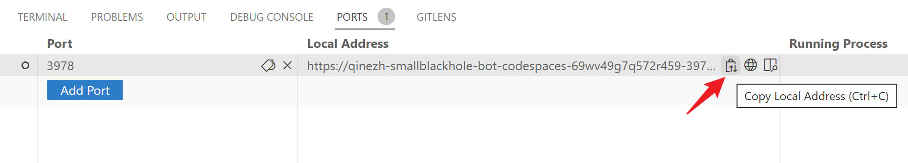

# Run TeamsFx Bot in Codespaces

## Steps to debug:
1. Open the repo in Codespaces.
1. Click `Teams Toolkit` icon from the left sidebar and Sign in M365 account.
   > **Note**:
   >
   > After login your M365 account, it will be redirected to a localhost endpoint like `http://localhost:xxx/?code=xxxxxxxxx`.
   >
   > Copy the localhost endpoint from the address bar and run below command in the VS Code terminal in Codespaces: `curl <localhost-endpoint>`  
   >
   > Then you should login your M365 account.
1. Copy the local address for `https://localhost:3978`:
   
1. Go to `.vscode/tasks.json` and search for `botMessagingEndpoint`, replace the value with the local address pasted in last step.
1. Type `F5`.
1. After the teams web client is launched, to trigger a notification, run below command in the VS Code terminal in Codespaces:
   `curl -X POST http://localhost:3978/api/notification`
